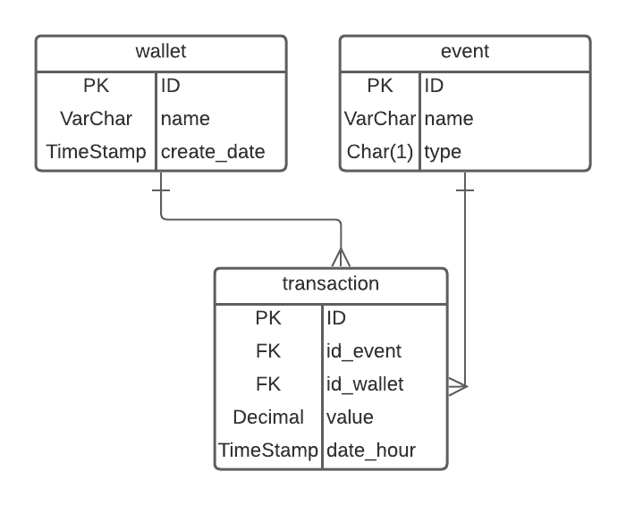

 
API para o Teste BackEnd PicPay utilizando **Express** 
   
  <!--
  -->

## Description

[Express](https://expressjs.com/pt-br/) framework.

## Arquitetura

A API foi construída utilizando o <b>Repository Pattern</b>.

### Repository/Services
Foi escolhido o TypeORM para gerenciamento dos repositories e banco de dados,  mesmo com o TypeORM foi construido repositories sql e repositories inMemory para os testes

Em src/services encontra toda regra da aplicação e as conexões com os repositories.

Foi utilizado injeção de dependencia dos Repository nos Services, assim o service não precisa saber qual é o repository.

### Escala da Arquitetura
Para deixar a aplicação fácil de scalar foi construido um Observe, Publish e Handler, assim toda transação que chega na API é publicada no Publish e observado pelo Observer, assim fica fácil construir um sistema de filas sem alterar a regra da aplicação

### Testes
Os testes de services está em src/services/index.test.ts 

Para os testes foi criado um DataSource especifico para teste, validando os dados comunicando com o banco.
 

## Banco
O banco SQL escolhido foi o Postgres, com a utilização do TypeORM é possível trocar a tecnologia do banco sem mexer na regra da aplicação.

### DER

Para o Banco imaginei a seguinte estrutura:

**Account** onde armazena os dados do cliente, aqui ficaria outras informações como agencia e conta.  
**Events** tabela de eventos fica armazenado os tipos de eventos como Crédito, Débito, Compra, Pix, TED... qualquer evento que seja preciso adicionar no sistema basta inserir na tabela.   
Em **Type** fica salvo o tipo de evento se é Crédito ou Débito, neste caso usei apenas os dois simbolizando crédito em conta ou débito em conta.
  Ex: 
- Compras é um débito em conta Type = D
- Receber pix é um crédito em conta Type = C

Assim eu consigo saber se aquele evento vai retirar ou debitar dinheiro da conta

**Transaction** é a tabela de transações onde consta o valor da transação, evento e o conta

