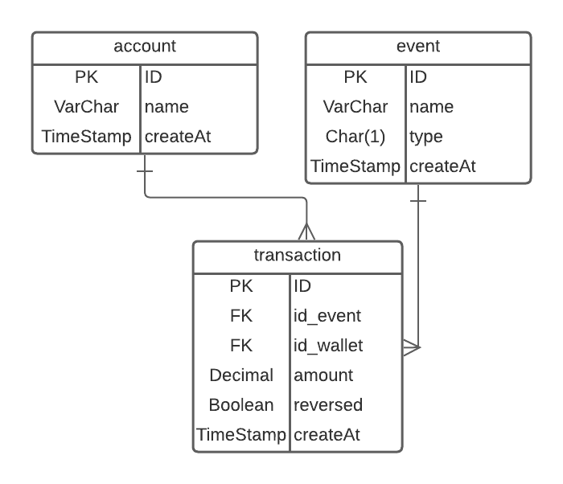

# picpay-api-wallet

Desenvolvimento de uma Wallet para o desafio PicPay

## Banco de Dados

Foi desenvolvido um DER do banco:

- Wallet: Representa a carteira do cliente
- event: Criei uma tabela para salvar o evento que a carteira pode ter, compra, deposito, pix, ted, cashback.
em event tenho o type (C | D) C = crédito e D = débito, para entender se o evento insere ou retira dinheiro da carteira
- transaction: Seria a transações do cliente

